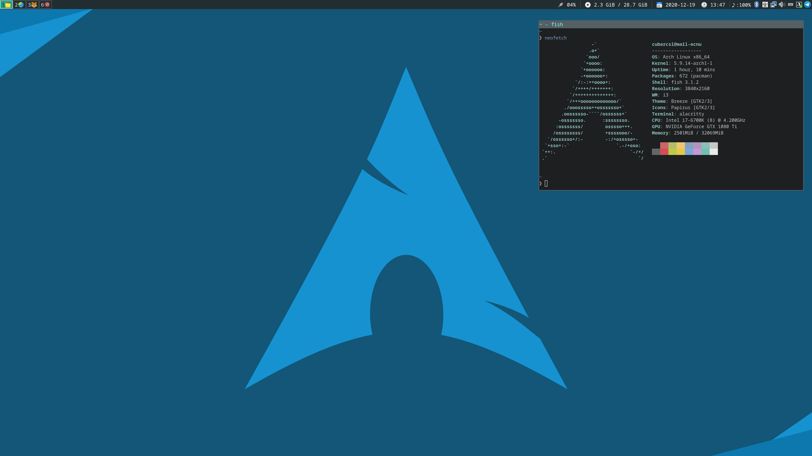

# dotfiles

我的 [Arch Linux](https://www.archlinux.org/) 下的配置文件

## 参考软件清单
- SHELL: [fish](https://www.archlinux.org/packages/?q=fish) [oh-my-fish](https://github.com/oh-my-fish/oh-my-fish)
- 窗口管理器：[i3-gap](https://www.archlinux.org/packages/?q=i3-gaps)
- 锁屏：[i3exit](https://aur.archlinux.org/packages/K=i3exit) (AUR)
- 状态栏：[i3status](https://www.archlinux.org/packages/?q=i3status)
- 启动器：[rofi](https://www.archlinux.org/packages/?q=rofi)
- 图标：[papirus-icon-theme](https://www.archlinux.org/packages/?q=papirus-icon-theme)
- 窗口模糊：[picom](https://www.archlinux.org/packages/?q=picom)
- 通知：[dunst](https://www.archlinux.org/packages/?q=dunst)
- 音频：[pulseaudio](https://www.archlinux.org/packages/?q=pulseaudio) [pulseaudio-alsa](https://www.archlinux.org/packages/?q=pulseaudio-alsa) [pavucontrol](https://www.archlinux.org/packages/?q=pavucontrol) [pasystray](https://www.archlinux.org/packages/?q=pasystray)
- 蓝牙：[pulseaudio-bluetooth](https://www.archlinux.org/packages/?q=pulseaudio-bluetooth) [blueman](https://www.archlinux.org/packages/?q=blueman)
- 输入法：[fcitx5](https://www.archlinux.org/packages/?q=fcitx5) [fcitx5-rime](https://www.archlinux.org/packages/?q=fcitx5-rime) [fcitx5-gtk](https://www.archlinux.org/packages/?q=fcitx5-gtk) [fcitx5-qt](https://www.archlinux.org/packages/?q=fcitx5-qt) [fcitx5-configtool](https://www.archlinux.org/packages/?q=fcitx5-configtool) [fcitx5-material-color](https://www.archlinux.org/packages/?q=fcitx5-material-color) 个人使用的是小鹤音形。
- 终端模拟器：[alacritty](https://www.archlinux.org/packages/?q=alacritty)
- 文件管理器：[pcmanfm](https://www.archlinux.org/packages/?q=pcmanfm)
- 压缩与解压：[xarchiver](https://www.archlinux.org/packages/?=xarchiver)
- 截图：[flameshot](https://www.archlinux.org/packages/?q=flameshot)
- 雷蛇键盘：[openrazer-meta](https://aur.archlinux.org/packages/openrazer-meta)(AUR) [polychromatic](https://aur.archlinux.org/packages/polychromatic)(AUR)
- 科学上网：[qv2ray](https://aur.archlinux.org/packages/qv2ray)(AUR)(archlinuxcn)
- 浏览器：[chromium](https://www.archlinux.org/packages/?q=chromium)
- 编辑器：[visual-studio-code-bin](https://aur.archlinux.org/packages/visual-studio-code-bin)(AUR)(archlinuxcn)
